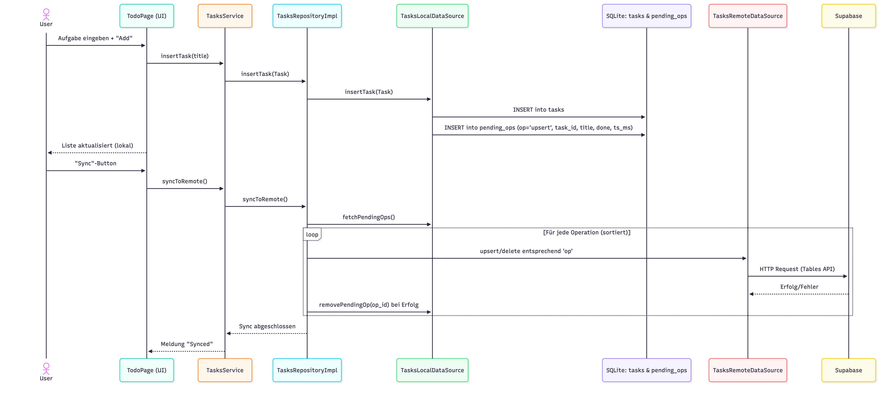

## Supabase-Integration in diesem Flutter-Projekt (mit Ausblick auf Firebase Auth)

## 1) Voraussetzungen
- Ein Supabase-Projekt mit
  - `Project URL` und `anon`-Key
- Dieses Flutter-Projekt mit `.env` Datei:
  - `SUPABASE_URL=...`
  - `SUPABASE_ANON_KEY=...`

Die `.env` wird zur Laufzeit geladen (siehe Code unten).

---

## 2) Abhängigkeiten (pubspec.yaml)
Im Projekt ist `supabase_flutter` bereits eingebunden:

```
dependencies:
  flutter:
    sdk: flutter
  sqflite: ^2.3.3+1
  path: ^1.9.0
  path_provider: ^2.1.5
  shared_preferences: ^2.5.3
  uuid: ^4.5.1
  flutter_dotenv: ^5.1.0
  supabase_flutter: ^2.6.0
```

---

## 3) Konfiguration der Umgebungsvariablen
`EnvService` lädt die `.env` und stellt `SUPABASE_URL` und `SUPABASE_ANON_KEY` bereit:

```
import 'package:flutter_dotenv/flutter_dotenv.dart';

class EnvService {
  EnvService._();
  static final EnvService instance = EnvService._();

  Future<void> init() async {
    try {
      await dotenv.load(fileName: '.env');
    } catch (_) {
      print('Error loading .env');
    }
  }

  String? get supabaseUrl => dotenv.env['SUPABASE_URL'];
  String? get supabaseAnonKey => dotenv.env['SUPABASE_ANON_KEY'];
}
```

---

## 4) Initialisierung von Supabase
In `main.dart` wird Supabase mit den Werten aus `.env` initialisiert:

```
import 'package:flutter/material.dart';
import 'package:sqflite_supabase_b11/app.dart';
import 'package:supabase_flutter/supabase_flutter.dart';

import 'application/env_service.dart';

void main() async {
  WidgetsFlutterBinding.ensureInitialized();
  await EnvService.instance.init();
  final url = EnvService.instance.supabaseUrl;
  final anonKey = EnvService.instance.supabaseAnonKey;
  await Supabase.initialize(url: url!, anonKey: anonKey!);
  runApp(const App());
}
```

Wichtig: `Supabase.instance.client` steht danach überall zur Verfügung.

---

## 5) Datenzugriff: Beispiel `TasksRemoteDataSource`
Die Remote-Datenquelle nutzt den Supabase-Client, um CRUD-Operationen auf der Tabelle `tasks` auszuführen:

```
SupabaseClient get _client => Supabase.instance.client;

String get _table => 'tasks';

Future<List<Task>> fetchAll() async {
  final rows = await _client.from(_table).select('*').order('id', ascending: false);
  final list = (rows as List)
      .map((e) => e as Map<String, dynamic>)
      .map(
        (m) => Task(
          id: m['id'] as int?,
          title: m['title'] as String,
          done: (m['done'] as bool?) ?? false,
        ),
      )
      .toList();
  return list;
}
```

```
Future<Task> insertTask(Task task) async {
  final data = await _client
      .from(_table)
      .insert(<String, dynamic>{'title': task.title, 'done': task.done})
      .select()
      .single();
  return Task(
    id: data['id'] as int?,
    title: data['title'] as String,
    done: (data['done'] as bool?) ?? false,
  );
}
```

Weitere Methoden (`updateDone`, `deleteById`, `clearAll`) sind analog aufgebaut.


---

## 6) RLS und Sicherheit (nur für Self-Hosting zwingend)
Wenn ihr Supabase selbst hostet, müsst ihr eine restriktive RLS-Policy definieren, die ausschließlich Tokens eurer Supabase-Instanz und eures Firebase-Projekts akzeptiert. Das vermeidet unbefugten Zugriff.

Eine ausführliche Anleitung findet ihr in der offiziellen Dokumentation (https://supabase.com/docs/guides/database/postgres/row-level-security).

---

## 7) SQL Editor: Tabelle anlegen
Öffnet in Supabase den SQL Editor und führt folgendes Skript aus, um die Tabelle `tasks` anzulegen:

```sql
create table if not exists public.tasks (
  id bigint generated by default as identity primary key,
  title text not null,
  done boolean not null default false
);
```

Hinweis: Falls ihr RLS verwenden möchtet, aktiviert sie separat und ergänzt passende Policies (siehe Abschnitt 6).

---

## 8) Wie funktioniert der Code (Architektur & Ablauf)

Dieser Abschnitt erklärt die Struktur und den Ablauf der Datenfluss-Logik in diesem Projekt – von der UI über die lokalen Daten (SQLite) bis zur Synchronisation mit Supabase.

### Bausteine
- **Entity `Task`**: Domänenobjekt mit `id`, `title`, `done`.
- **Local Data Source (`TasksLocalDataSource`)**:
  - Speichert Aufgaben in SQLite-Tabelle `tasks`.
  - Schreibt jede Änderung zusätzlich als Operation in die Tabelle `pending_ops` (Mutation-Queue) via `_enqueueUpsert`/`_enqueueDelete`.
  - Bietet `fetchPendingOps()` und `removePendingOp(opId)` für die Synchronisation an.
- **Remote Data Source (`TasksRemoteDataSource`)**:
  - Führt CRUD-Operationen auf der Supabase-Tabelle `tasks` aus (via `Supabase.instance.client`).
- **Repository (`TasksRepositoryImpl`)**:
  - Liefert Daten an die App, bevorzugt aus der lokalen DB für schnelle, offlinefähige Zugriffe (`fetchAll()`).
  - Nimmt Änderungen entgegen (insert/update/delete) und delegiert diese zunächst lokal.
  - Führt mit `syncToRemote()` die ausstehenden Operationen in `pending_ops` geordnet (nach `ts_ms`, `op_id`) gegen Supabase aus.
- **Service/UI**:
  - In `app.dart` ruft der Sync-Button `TasksService.syncToRemote()` auf, welcher an das Repository weiterleitet.

### Offline-First Idee
- Änderungen werden sofort lokal gespeichert und als Operationen in `pending_ops` protokolliert.
- Das ermöglicht funktionierende App-Interaktionen ohne Netzwerk.
- Später werden die Operationen „in Reihenfolge“ zu Supabase übertragen (eventual consistency).

### Ablauf der App



---

## 9) Weiterführende Links
- Supabase: Firebase Auth als Third-Party integrieren  (https://supabase.com/docs/guides/auth/third-party/firebase-auth?queryGroups=firebase-create-client&firebase-create-client=dart)


